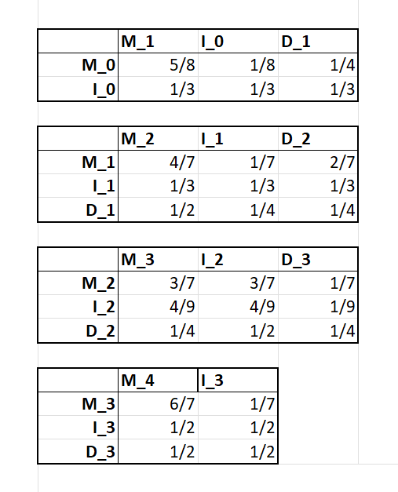

```{r setup, include=FALSE}
knitr::opts_chunk$set(echo = TRUE)
library(ggplot2)
library(dplyr)
library(knitr)
```
## Question 8

Here we simply perform a pseudocount of the emitted symbol for all match states. 
We then compute the probabilities.

```{r}
A <- c(5/8, 1/8, 6/9)
C <- c(1/8, 1/8, 1/9)
G <- c(1/8, 5/8, 1/9)
T <- c(1/8, 1/8, 1/9)

answer <- matrix(c(A,C,G,T),
                 nrow= 4,
                 ncol= 3,
                 dimnames = list(c("A","C","G","T"),
                                 c("1","2","3")))
                 
                 
kable(answer,
      caption= "Match emission probabilities",
      digits = 3)
```

## Question 9

Here we simply perform a pseudocount of the emitted symbol for all insertions states.
We only observe emissions from insertion state 2.
We note that we could also include the zeroth insert state, as per our graphical model, which would have the same probabilities as 1 and 3.


```{r}
a<- c(1/4, 6/10, 1/4)
b <- c(1/4, 1/10, 1/4)
c <- c(1/4, 2/10, 1/4)
g <- c(1/4, 1/10, 1/4)

answer <- (matrix(c(a,b,c,g),
                 nrow= 3,
                 ncol= 4,
                 dimnames = list(c("State 1","State 2","State 3"),
                                 c("A","C","G","T"))))
                 
                 
kable(answer,
      caption= "Insert state emission probabilities",
      digits = 3)
```

## Question 10 

Here we simply perform a pseudocount of the observed state transitions and compute probabilities.

{width=50%}

## Question 11
### 1
```{r }

# load the source code 
source("code/profileHMM.R")
```
### 2
```{r}
GTP_binding_proteins <- parseAlignment('data/GTP_binding_proteins.txt')
ATPase <- parseAlignment('data/ATPases.txt')
```
### 3
```{r}
GTP_hmm <- learnHMM(GTP_binding_proteins)
ATP_hmm <- learnHMM(ATPase)
```

### 4
```{r}
# Identify position with highest match and insert emission frequencies over all symbols   
# Initialise matrices for: (index shift because of begin state)
# match emissions (mE)
# insertion emssions (iE)
# transitions (T)

mE <- GTP_hmm$mE
iE <- GTP_hmm$iE

# set all NA values to 0
mE[is.na(mE)] <- 0
# find the max match frequency for all positions
max_mE <- apply(mE, 2, max)
# find the max position out of all positions
max_pos <- which(max_mE == max(max_mE))

# find the max insertion frequency for all positions
max_iE <- apply(iE, 2, max)
# find the max position out of all positions
max_pos_i <- which(max_iE == max(max_iE))

data_mE <- data.frame(freq = mE[,max_pos], symbol = rownames(mE))
ggplot(data_mE, aes(x = symbol, y = freq)) + 
  geom_bar(stat="identity", color="blue", fill="white") + 
  labs(title= "Match Emission Frequencies for Position with max probability", 
       x= "Symbols", 
       y= "Match Emission Frequencies")

# do the same for insertion frequency 
data_iE <- data.frame(freq = iE[,max_pos_i], symbol = rownames(iE))
ggplot(data_iE, aes(x= symbol, y= freq)) + 
  geom_bar(stat="identity", color= "blue", fill= "white") + 
  labs(title= "Insertion Emission Frequencies for Position with max probability", 
       x= "Symbols", 
       y= "Insertion Emission Frequencies")
```

```{r}
# Same analysis for ATP hmm 
mE <- ATP_hmm$mE
iE <- ATP_hmm$iE

# set all NA values to 0
mE[is.na(mE)] <- 0
# find the max match frequency for all positions
max_mE <- apply(mE, 2, max)
# find the max position out of all positions
max_pos <- which(max_mE == max(max_mE))

# find the max insertion frequency for all positions
max_iE <- apply(iE, 2, max)
# find the max position out of all positions
max_pos_i <- which(max_iE == max(max_iE))

data_mE <- data.frame(freq = mE[,max_pos], symbol = rownames(mE))
ggplot(data_mE, aes(x = symbol, y = freq)) + 
  geom_bar(stat="identity", color="blue", fill="white") + 
  labs(title= "Match Emission Frequencies for Position with max probability", 
       x= "Symbols", 
       y= "Match Emission Frequencies")

# do the same for insertion frequency 
data_iE <- data.frame(freq = iE[,max_pos_i], symbol = rownames(iE))
ggplot(data_iE, aes(x= symbol, y= freq)) + 
  geom_bar(stat="identity", color= "blue", fill= "white") + 
  labs(title= "Insertion Emission Frequencies for Position with max probability", 
       x= "Symbols", 
       y= "Insertion Emission Frequencies")
```
### 5 
```{r load unknown dataset}
UnknowPr <- parseProteins("data/Unclassified_proteins.txt")
```

### 6

```{r return the protein log odds}
OddList <- unlist(lapply(UnknowPr, function(protein){
  OddGTP <- forward(HMM = GTP_hmm, seq = protein)
  OddATP <- forward(HMM = ATP_hmm, seq = protein)
  return(OddGTP - OddATP)
}))
```

```{r plot the protein log odds}
plot(OddList, xlab = "Protein index", ylab = "log odd GTP-binding over ATPase")
```
With the plot shown above, we can tell clearly the protein classifications for all unknown protein as they are all separable. 
