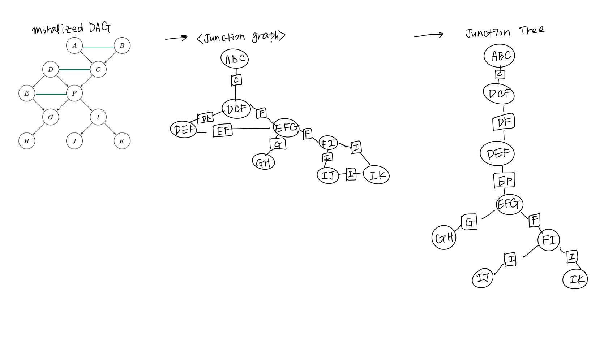

```{r, echo=FALSE}
library(knitr)
```


## Problem 17 
### (a)
```{r, echo=FALSE}

```

### (b)
We can obtain the joint probability by multiplying the cluster potentials together and dividing them by the separator potentials. 
```{=tex}
\begin{align}
P(U) = \frac{\psi(A, B, C)\psi(D,C,F)\psi(D,E,F)\psi(E,F,G)\psi(G,H)\psi(F,I)\psi(I,J)\psi(I,K)}{\psi(C)\psi(D,F)\psi(E,F)\psi(G)\psi(F)\psi(I)^2}
\end{align}
```


## Problem 18
### (a)
The formula for recursively computing forward and backward messages is as below. 
```{=tex}
\begin{align}
  \mu_\alpha(x_n) = \sum_{x_{n-1}} \psi_{n-1,n}(x_{n-1}, x_n) \mu_\alpha(x_{n-1})
\end{align}
```

```{=tex}
\begin{align}
  \mu_\beta(x_n) = \sum_{x_{n+1}} \psi_{n,n+1}(x_{n}, x_{n+1}) \mu_\beta(x_{n+1})
\end{align}
```

### (b)
We can calculate the marginal probability $P(X_4=1)$ with the forward and backward messages with the equation below. 
```{=tex}
\begin{align}
  P(x_4=1) = \frac{1}{Z} \mu_\alpha(x_4) \mu_\beta(x_4) \\
  =\frac{1}{Z} [\sum_{x_3} \psi_{3,4} \sum_{x_2} \psi_{2,3} \sum_{x_1} \psi_{1,2}] [\sum_{x_5} \psi_{4,5}]
\end{align}
```
Given it's a general case, the runtime would be $O(4k^2) = O(k^2)$ and k is the number of possible values $x_n$ can have. 

### (c)
For the general case of N components and K different values for each random variable, the runtime complexity is $O(nK^2)$. 

To calculate the marginal probability using forward and backward algorithms, we need to calculate n-1 forward messages and n-1 backward messages. And given each random variable can take K values, the complexity to calculate each messages is K^2 as each messages requires to sum up all the possible choices for a pair of variable. Once we have all forward and backward messages, the marginal probabilities are only different products of forward and backward messages. Hence the computational complexity is just the computational complexity for calculating all the messages, i.e. $O(nK^2)$. 

For the normalization factor Z, for each component it take $O(K)$ to sum up all product value, hence to calculate Z the runtime is $O(nK)$, which is smaller comparing to $O(nK^2)$. Hence the final runtime is $O(nK^2)$

When N is equal to 5, the runtime will thus be $O(K^2)$. 


## Problem 19 
### (a) Computing clique potential 
We can calculate the clique potential $\psi_{1,2}(X_1, X_2) = P(X_1)P(X_2|X_1)$, and similarly for other potentials.  
```{r}
margProb <- list()
margProb[[1]] <- c(2/3, 1/3)

cliPotAry <- list()
cliPotAry[["Psi12"]] <- rbind(c(1/5, 4/5), c(1/3, 2/3))
cliPotAry[["Psi23"]] <- rbind(c(2/7, 5/7), c(2/3, 1/3))
cliPotAry[["Psi34"]] <- rbind(c(2/5, 3/5), c(3/5, 2/5))
cliPotAry[["Psi45"]] <- rbind(c(1/2, 1/2), c(2/9, 7/9))

for (ind in seq_along(cliPotAry)) {
  cliPotAry[[ind]]  <- cliPotAry[[ind]]*margProb[[ind]]
  margProb[[ind+1]] <- colSums(cliPotAry[[ind]])
}

cliPotAry
```

### (b) Computing forward messages
We initialize $\mu_\alpha(x_1) = 1$ for $x_1 \in \{0,1\}$. We know that we can calculate the forward message with this formula: $\mu_\alpha(x_n) = \sum_{x_{n-1}} \psi_{n-1,n}(x_{n-1}, x_n) \mu_\alpha(x_{n-1})$. That's why we can compute the messages with the matrix product of the vector $\mu_\alpha(X_{n-1} = 0), \mu_\alpha(X_{n-1} = 1)$ multiplied by the clique potentials from (a).

```{r}
# Initialize the forward messages array
forward_messages <- array(0, dim = c(2, 5), dimnames = list(c("0", "1"), c("X1", "X2", "X3", "X4", "X5")))

# initializing 
forward_messages[,"X1"] <- c(1,1)
# computing forward messages
forward_messages[,"X2"] <- forward_messages[,"X1"] %*% cliPotAry$"Psi12"
forward_messages[,"X3"] <- forward_messages[,"X2"] %*% cliPotAry$"Psi23"
forward_messages[,"X4"] <- forward_messages[,"X3"] %*% cliPotAry$"Psi34"
forward_messages[,"X5"] <- forward_messages[,"X4"] %*% cliPotAry$"Psi45"

forward_messages
```

### (c) Computing backward messages
We can compute the backward messages in a similar fashion. 

```{r}
# Initialize the backward messages array 
backward_messages <- array(0, dim = c(2, 5), dimnames = list(c("0", "1"), c("X5", "X4", "X3", "X2", "X1")))

# initializing 
backward_messages[,"X5"] <- c(1,1)

# computing backward messages
backward_messages[,"X4"] <- cliPotAry$"Psi45" %*% backward_messages[,"X5"]
backward_messages[,"X3"] <- cliPotAry$"Psi34" %*% backward_messages[,"X4"]
backward_messages[,"X2"] <- cliPotAry$"Psi23" %*% backward_messages[,"X3"]
backward_messages[,"X1"] <- cliPotAry$"Psi12" %*% backward_messages[,"X2"]

backward_messages
```


### (d) Computing probability distribution for each node 
First we will multiply the forward and backward messages for each position.
```{r}
nodes <- c("X1", "X2", "X3", "X4", "X5")
product_messages <- array(0, dim = c(2, 5), dimnames = list(c("0", "1"), nodes))
final_answer <- c()

for (n in nodes) {
  prod <- forward_messages[,n] * backward_messages[,n]
  product_messages[,n] <- prod
  norm_coef <- sum(prod)
  final_answer <- cbind(product_messages/norm_coef)
} 

final_answer
```